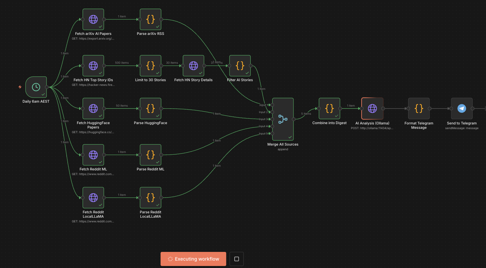

# AI Research Digest



An n8n workflow that aggregates the latest AI/ML news, papers, and discussions from multiple sources, then delivers a curated daily digest to Telegram.

## What It Does

```
┌─────────────────────────────────────────────────────────────────────────────┐
│                         DAILY 6AM AEST                                       │
├─────────────────────────────────────────────────────────────────────────────┤
│                                                                              │
│  Schedule Trigger ──┬──▶ arXiv RSS (cs.AI, cs.LG, cs.CL)                    │
│  (6am Sydney)       ├──▶ Hacker News API (AI-filtered)                      │
│                     ├──▶ HuggingFace Daily Papers                           │
│                     ├──▶ Reddit r/MachineLearning                           │
│                     └──▶ Reddit r/LocalLLaMA                                │
│                                │                                             │
│                                ▼                                             │
│                     ┌─────────────────────┐                                 │
│                     │   Merge & Process   │                                 │
│                     │   (Parse & Filter)  │                                 │
│                     └─────────────────────┘                                 │
│                                │                                             │
│                                ▼                                             │
│                     ┌─────────────────────┐                                 │
│                     │   Ollama llama3.2   │                                 │
│                     │   (AI Analysis)     │                                 │
│                     └─────────────────────┘                                 │
│                                │                                             │
│                                ▼                                             │
│                     ┌─────────────────────┐                                 │
│                     │  Telegram Delivery  │                                 │
│                     │  (Formatted Digest) │                                 │
│                     └─────────────────────┘                                 │
└─────────────────────────────────────────────────────────────────────────────┘
```

## Problem Solved

- **Information overload** - Too many sources to check manually
- **Missing important news** - Papers and announcements slip by
- **Time spent browsing** - Hours scrolling through feeds
- **No signal from noise** - Hard to identify what actually matters

## Sources

| Source | What It Fetches | Filter |
|--------|-----------------|--------|
| arXiv | AI/ML/NLP papers | cs.AI, cs.LG, cs.CL categories |
| Hacker News | Top stories | AI keywords, 50+ upvotes |
| HuggingFace | Daily papers | Top 8 papers |
| r/MachineLearning | Hot posts | 30+ upvotes |
| r/LocalLLaMA | Hot posts | 20+ upvotes |

## Stack (All Local - Zero API Costs)

| Component | Service | Notes |
|-----------|---------|-------|
| LLM | Ollama (llama3.2) | 2GB model, runs locally |
| Workflow | n8n | Port 5678 |
| Delivery | Telegram Bot | Your existing bot |
| Schedule | n8n Cron | 6am AEST daily |

## Setup

### Prerequisites

- n8n running with Docker (see main README)
- Ollama with llama3.2 model:
  ```bash
  docker exec ollama ollama pull llama3.2:latest
  ```
- Telegram bot configured in n8n (from SeedDream workflow)

### 1. Import Workflow

1. Open n8n at `http://localhost:5678`
2. Go to Workflows → Import from File
3. Select `workflows/ai-research-digest.json`

### 2. Configure Credentials

1. **Ollama API** (if not already configured):
   - Go to Credentials → Add Credential → Ollama API
   - Base URL: `http://host.docker.internal:11434`

2. **Telegram Bot** (if not already configured):
   - Go to Credentials → Add Credential → Telegram API
   - Enter your bot token from @BotFather

### 3. Update Telegram Chat ID

1. Open the workflow
2. Click on "Send to Telegram" node
3. Replace `YOUR_TELEGRAM_CHAT_ID` with your actual chat ID
   - Get your chat ID by messaging your bot and visiting:
     `https://api.telegram.org/bot<YOUR_BOT_TOKEN>/getUpdates`

### 4. Set Timezone

The workflow is configured for Australia/Sydney timezone. The schedule triggers at 6am AEST.

### 5. Activate Workflow

1. Click the "Active" toggle in the top-right corner
2. The workflow will run daily at 6am

## Testing

To test immediately without waiting for the schedule:

1. Open the workflow
2. Click "Test Workflow" button
3. Check your Telegram for the digest

## Sample Output

```
🤖 **AI Research Digest**
📅 2024-01-15

📊 **Today's Analysis**
Pulse: Hot 🔥

Key highlights today:
1. OpenAI released GPT-5 preview with significant reasoning improvements
2. New SOTA on protein folding from DeepMind
3. Community excitement around local models with Llama 3 fine-tuning

━━━━━━━━━━━━━━━━━━━━━━

📚 **arXiv Papers**
1. [Attention Is All You Need 2.0: Quadratic to Linear...](https://arxiv.org/...)
2. [Multi-Agent Reasoning with Chain-of-Thought...](https://arxiv.org/...)

🔥 **Hacker News**
1. [Claude 3.5 Sonnet beats GPT-4 on benchmarks](https://...) (523⬆)
2. [Show HN: I built a local RAG system](https://...) (312⬆)

🤗 **HuggingFace Papers**
1. [Scaling Laws for Fine-Tuning](https://huggingface.co/papers/...)

💬 **r/MachineLearning**
1. [New paper shows emergent abilities are a mirage](https://...) (892⬆)

🦙 **r/LocalLLaMA**
1. [llama.cpp now supports Mistral MoE](https://...) (456⬆)

━━━━━━━━━━━━━━━━━━━━━━
_Curated by your AI Research Agent_
```

## Customization

### Change Schedule Time

Edit the "Daily 6am AEST" node and adjust the trigger time.

### Add More Sources

Add new HTTP Request nodes for additional APIs:
- GitHub Trending (API or scrape)
- Twitter/X (requires API access)
- Substack newsletters (RSS)

### Modify AI Analysis

Edit the "AI Analysis" node's system prompt to change:
- Analysis focus areas
- Output format
- Persona/tone

### Adjust Filters

Edit the Code nodes to change:
- Minimum upvote thresholds
- Keyword filters for HN
- Number of items per source

## AI/Tech Twitter Accounts

For manual reference, here are top accounts to follow:

**Companies:**
- @OpenAI, @GoogleDeepMind, @GoogleAI
- @AnthropicAI, @MetaAI, @NVIDIAAI
- @MSFTResearch, @IBMResearch, @Tesla_AI

**Researchers:**
- @AndrewYNg, @ylecun, @demishassabis
- @drfeifei, @fchollet, @GaryMarcus
- @kaborhbeck, @pabbeel, @hugo_larochelle

## Troubleshooting

### Workflow Not Triggering

1. Ensure workflow is active (toggle in top-right)
2. Check timezone settings in n8n
3. Verify cron schedule in Schedule Trigger node

### Empty Digest

1. Check each source node for errors
2. Test HTTP requests manually with curl
3. Reddit may rate-limit - add delay between requests

### Ollama Connection Issues

```bash
# Check if Ollama is running
docker exec ollama ollama list

# Test from n8n container
docker exec n8n curl http://host.docker.internal:11434/api/tags
```

### Telegram Not Sending

1. Verify bot token is correct
2. Confirm chat ID is correct
3. Check bot has permission to message you

## Files

```
/Users/peterpreketes/n8n/
├── workflows/
│   └── ai-research-digest.json    # Main workflow
└── README-ai-research-digest.md   # This file
```

## Future Improvements

- [ ] Add GitHub Trending AI repos
- [ ] Add Twitter/X integration (requires API)
- [ ] Add Substack AI newsletters (RSS)
- [ ] Create weekly summary compilation
- [ ] Add paper abstract summarization
- [ ] Implement semantic deduplication

---

*Built with n8n + Ollama - 100% local, zero API costs*
